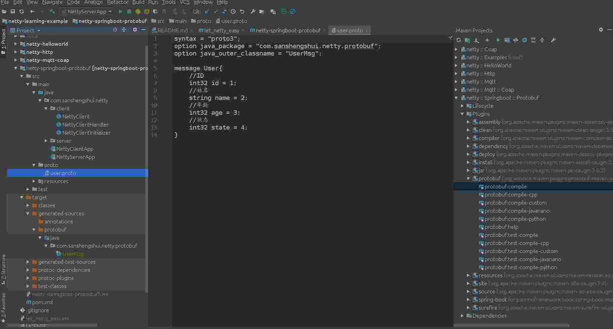

# let-netty-easy
netty实践学习案例,是netty初学者及核心技术巩固的最佳实践


## a.『 基础 - 入门篇 』
- netty-helloworld<br>
  [《netty 之 telnet HelloWorld 详解》](https://github.com/sanshengshui/netty-learning-example/tree/master/netty-helloworld)<br>

- netty-http<br>
  [《netty 之 高性能http服务器 详解》](https://github.com/sanshengshui/netty-learning-example/tree/master/netty-http)<br>

  ------

- netty-springboot-protobuf<br>
  [《netty 之 netty整合springboot并使用protobuf进行传输》](https://github.com/sanshengshui/netty-learning-example/tree/master/netty-springboot-protobuf)<br>

  ### 使用说明


  #### 软件架构说明

  1. 使用netty实现通信
  2. 使用springboot提供依赖注入及属性配置
  3. 使用protobuf进行协议编解码,并使用grpc优雅的把.proto文件转成编译成.class文件
  4. 使用lombok的@slf4j,进行输出打印,日志.

  #### 项目结构

  ```
  netty-springboot-protobuf
    ├── client
      ├── NettyClient.class -- 客户端启动类
      ├── NettyClientHandler.class -- 客户端逻辑处理类
      ├── NettyClientHandler.class -- 客户端初始化类
    ├── server 
      ├── NettyServer.class -- 服务端启动类
      ├── NettyServerHandler -- 服务端逻辑处理类
      ├── NettyClientInitializer -- 服务端初始化类
    ├── NettyClientApp.class -- 客户端快速启动类入口
    ├── NettyServerApp.class -- 服务端快速启动类入口
    ├── proto
      ├── user.proto -- 传输数据protobuf文件
  ```


  #### 功能说明

1. 接入验证
2. 心跳检测
3. 断开重连
4. 上传数据
5. 主动推送功能

  #### 快速开始

- JDK1.8

- Lombok插件安装

- 编译user.proto文件,双击protobuf:compile,如下图!

- 项目里面包含Socket客户端和服务端

  - 找到com.sanshengshui.netty.NettyClientApp类右键debug as启动SocketServer
  - 找到com.sanshengshui.netty.NettyServerApp类右键debug as启动客户端

  

