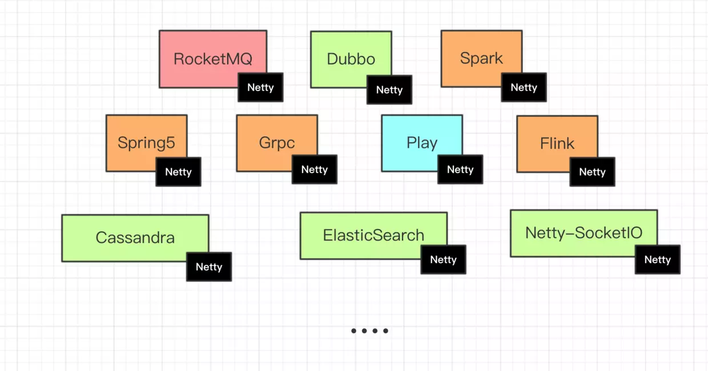

# Netty-learning-example  

## 前言:
**You built it,You run it!**

> **尚未完成，持续更新中...!**

备注: :wrench: :表示**施工中,尚未完成**;   :memo: :表示**已完成,但是没有写博文**; :ok_hand: 表示**已完成,并有相应的博文**;

**什么是Netty?能做什么?**

- [Netty](https://netty.io/)是一个致力于创建高性能网络应用程序的成熟的IO框架

- 相比较与直接使用底层的Java IO API, 你不需要先成为网络专家就可以基于Netty去构建复杂的网络
  应用

- 业界常⻅的涉及到网络通信的相关中间件大部分基于Netty实现网络层,如下图所示:

  

本工程致力于netty实践学习案例,是netty初学者及核心技术巩固的最佳实践

## a.『 基础 - 入门篇 』

- :ok_hand: : netty-helloworld   
  [《netty 之 telnet HelloWorld 详解》](https://www.cnblogs.com/sanshengshui/p/9726306.html) 

## b. 『 基础 - 通讯协议篇 』

- 👌 :netty-http 
  [《netty 之 高性能http服务器 详解》](https://www.cnblogs.com/sanshengshui/p/9774746.html) 

- 👌 netty-springboot-protobuf  
  [《netty 之 netty整合springboot并使用protobuf进行传输》](https://www.cnblogs.com/sanshengshui/p/9741655.html) 

-  👌 netty-mqtt

  1. [《Netty实现高性能IOT服务器(Groza)之手撕MQTT协议篇上》](https://www.cnblogs.com/sanshengshui/p/9826009.html)
  2. [《Netty实现高性能IOT服务器(Groza)之精尽代码篇中》](https://www.cnblogs.com/sanshengshui/p/9859030.html)

## c. 『 中级 - 数据传输篇 』

Netty碰上关系型数据库:monkey:

-   :memo:netty-jpa-mysql

  [《netty之jpa持久化数据至MySql》](https://github.com/sanshengshui/netty-learning-example/tree/master/netty-jpa-mysql) 

Netty邂逅非关系数据库:horse:

- :wrench:: netty-mybatis-mongodb

  [《netty之mybaits持久化数据之mongodb》](https://github.com/sanshengshui/netty-learning-example/tree/master/netty-mybatis-mongodb) 

Netty助力流式计算:racehorse:

- :wrench:: netty-kafka

  [《netty 之 netty 整合 Kafka producer》](https://github.com/sanshengshui/netty-learning-example/tree/master/netty-kafka) 

## d. 『 高级 - 高级应用篇 』

- 👌 :netty-IM 

  ​	:four_leaf_clover:微信从 2011 年 1 月 21 日诞生至今，

  ​	已经成为国内数亿用户必不可少的即时通信工具，是男女老少手机中必备的顶级 App。Netty 是一个异步基于事件驱动的高性能网络通信框架，在互联网中间件领域网络通信层是无可争议的最强王者，两者强强联合又会擦出什么样的火花？下面给出一个优秀的小册,让大家快速掌握Netty! ​小册​作者​ ​闪电​侠​ [​G​i​t​H​u​b](https://github.com/lightningMan):four_leaf_clover:

  > 小册作者简介:某大型互联网公司基础架构部技术专家，主要做后台服务器的开发。精通 Netty，Spring，MyBatis，熟读互联网公司常见开发框架源码。负责公司各类长连项目的开发与维护，有千万级别实时在线连接，百亿吞吐的长连通信经验。

  

  ​    [Netty 入门与实战：仿写微信 IM 即时通讯系统](https://juejin.im/book/5b4bc28bf265da0f60130116)

  

- 👌 :netty-Rpc 

  :herb: 由于RPC的工程案例实在是太多，感觉我手写一个也没什么乐趣。

  所以我挑选了蚂蚁金融服务集团实现的基于Netty网络通讯框架([SOFABolt](https://github.com/alipay/sofa-bolt))源码解读文章，

  展示给阅读此工程的开发者。:herb:

  1. [《简述RPC实现原理》](https://www.cnblogs.com/sanshengshui/p/9769517.html) 
  2. [《蚂蚁通讯框架SOFABolt之私有通讯协议设计》](https://www.cnblogs.com/sanshengshui/p/10149217.html)
  3. [《蚂蚁金服通讯框架SOFABolt解析 | 编解码机制》](https://mp.weixin.qq.com/s?__biz=MzUzMzU5Mjc1Nw==&mid=2247484406&idx=1&sn=da3e3364efc313d0014958f6f71aca17&chksm=faa0ec2ccdd7653a2ec0758c9339c0cee8c0380c7fe29f0c5d000e70bbb978cb39f3342a936f&mpshare=1&scene=1&srcid=0510q5Rte9Va9edQbJsPtd03&pass_ticket=lR9I%2BTYIxmASKZM%2F324MFsv%2FPM9jQWUssfKtnSeM%2B5YosiCJ%2B%2BEdZYUXkdDyeWqL#rd)
  4. [《蚂蚁金服通讯框架SOFABolt解析 | 序列化机制(Serializer)》](https://mp.weixin.qq.com/s?__biz=MzUzMzU5Mjc1Nw==&mid=2247484425&idx=1&sn=a7162c88139e8faf25e7c321613a58be&chksm=faa0ebd3cdd762c59a02bff3f392a213452fde17b9b4317e37cab24470740bbc1adacfc12091&mpshare=1&scene=1&srcid=0510UsIkKm8Nd8ovZBzBXPXe&pass_ticket=lR9I%2BTYIxmASKZM%2F324MFsv%2FPM9jQWUssfKtnSeM%2B5YosiCJ%2B%2BEdZYUXkdDyeWqL#rd)
  5. [《蚂蚁金服通信框架SOFABolt解析 | 协议框架解析》](https://mp.weixin.qq.com/s?__biz=MzUzMzU5Mjc1Nw==&mid=2247484442&idx=1&sn=10141f9a20199e608ce5fd7f11ee4e29&chksm=faa0ebc0cdd762d60cedbfb079444e3e6d35383f063e060947bbcb622f86db39fded94f306f4&mpshare=1&scene=1&srcid=0510gpUOmETxmQAxe1epagTl&pass_ticket=lR9I%2BTYIxmASKZM%2F324MFsv%2FPM9jQWUssfKtnSeM%2B5YosiCJ%2B%2BEdZYUXkdDyeWqL#rd)
  6. [《蚂蚁金服通信框架SOFABolt解析 | 连接管理剖析》](https://mp.weixin.qq.com/s?__biz=MzUzMzU5Mjc1Nw==&mid=2247484457&idx=1&sn=151334a84ace245a04189735743c154a&chksm=faa0ebf3cdd762e566e1736f4dd958c23f1d48bfcd33ab7064715441426d9bc9c492eadb1b61&mpshare=1&scene=1&srcid=0510QYXE7uD9M0xonldbMIqK&pass_ticket=lR9I%2BTYIxmASKZM%2F324MFsv%2FPM9jQWUssfKtnSeM%2B5YosiCJ%2B%2BEdZYUXkdDyeWqL#rd)
  7. [《蚂蚁金服通信框架SOFABolt解析|超时控制机制及心跳机制》](https://mp.weixin.qq.com/s?__biz=MzUzMzU5Mjc1Nw==&mid=2247484545&idx=1&sn=bf386f40d33215d79943eaeffa91daf6&chksm=faa0eb5bcdd7624d1d179a514767a95692dd244a44339acccdccdfd38f44c5479a0ca708e744&mpshare=1&scene=1&srcid=0510JAmEphYy3r81Kj4Bb9ue&pass_ticket=lR9I%2BTYIxmASKZM%2F324MFsv%2FPM9jQWUssfKtnSeM%2B5YosiCJ%2B%2BEdZYUXkdDyeWqL#rd)

  

  👌 :netty-IOT

  ​	:ear_of_rice:随着技术的成熟，制造连接设备的成本正在下降。随之而来的是更广泛的物联网设备，从工业和企业应用到消费者家庭自动化（例如恒温器和智能空气过滤器）和智能汽车 - 甚至是连接内衣和牙线等眉毛般的“创新” 。连接和驱动这些设备的网络和技术（包括软件）正变得越来越强大。换句话说，就是能够实现事物互动的东西。:ear_of_rice:

  1. [《IOT市场与高性能服务器实现之路》](https://www.cnblogs.com/sanshengshui/p/9797352.html) 

  2. [《Netty实现高性能IOT服务器(Groza)之手撕MQTT协议篇上》](https://www.cnblogs.com/sanshengshui/p/9826009.html) 

  3. [《Netty实现高性能IOT服务器(Groza)之精尽代码篇下》](https://www.cnblogs.com/sanshengshui/p/9859030.html)

     ------

     拓展实践: [软件工程师树莓派获取室内温湿度的坎坷之旅](https://www.cnblogs.com/sanshengshui/p/9942963.html)

## e. 『 高级 - Netty特性,源码篇 』
   :mushroom: Redisson是一个在Redis的基础上实现的Java驻内存数据网格（In-Memory Data Grid）。它不仅提供了一系列的分布式的Java常用对象，还提供了许多分布式服务。其中包括(BitSet, Set, Multimap, SortedSet, Map, List, Queue ...) Redisson提供了使用Redis的最简单和最便捷的方法。Redisson的宗旨是促进使用者对Redis的关注分离（Separation of Concern），从而让使用者能够将精力更集中地放在处理业务逻辑上。:mushroom:
   1.  [《高性能/并发的保证-Netty在Redisson的应用》](https://www.cnblogs.com/sanshengshui/p/12669011.html) 

## f. 『 号外 - 相关知识归纳篇 』
- 👌 :语言指南(proto3) 
  [《Protobuf 语言指南(proto3)》](https://www.cnblogs.com/sanshengshui/p/9739521.html) 
- 👌 :测试工具篇(Gatling) 
  - [x] [负载,性能测试工具-Gatling](https://www.cnblogs.com/sanshengshui/p/9747069.html)
  - [x] [Gatling简单测试SpringBoot工程](https://www.cnblogs.com/sanshengshui/p/9750478.html)

