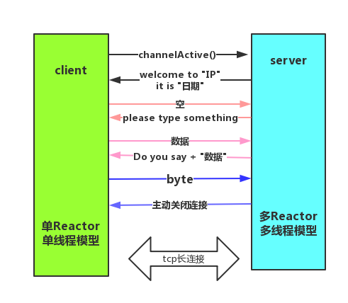
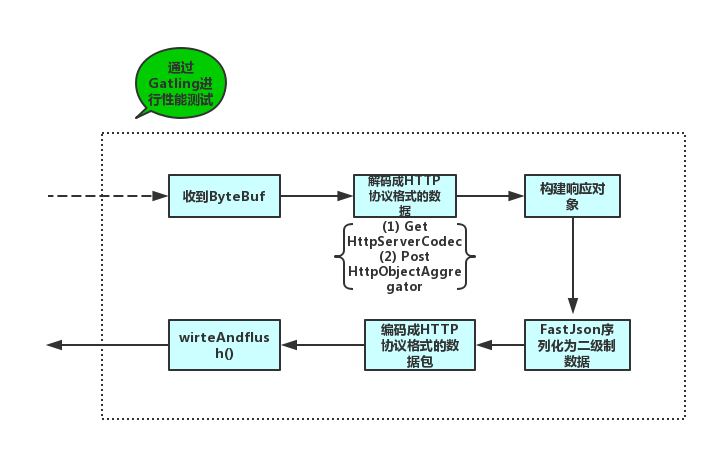

# let-netty-easy

## 前言:

> **尚未完成，持续更新中...!**

备注: :wrench: :表示**施工中,尚未完成**;   :memo: :表示**已完成,但是没有写博文**; :ok_hand: 表示**已完成,并有相应的博文**;

**什么是Netty?能做什么?**

- [Netty](https://netty.io/)是一个致力于创建高性能网络应用程序的成熟的IO框架

- 相比较与直接使用底层的Java IO API, 你不需要先成为网络专家就可以基于Netty去构建复杂的网络
  应用

- 业界常⻅的涉及到网络通信的相关中间件大部分基于Netty实现网络层,如下图所示:

  

本工程致力于netty实践学习案例,是netty初学者及核心技术巩固的最佳实践

## a.『 基础 - 入门篇 』

- :ok_hand: : netty-helloworld   
  [《netty 之 telnet HelloWorld 详解》](https://www.cnblogs.com/sanshengshui/p/9726306.html) 

## b. 『 基础 - 通讯协议篇 』

- 👌 :netty-http 
  [《netty 之 高性能http服务器 详解》](https://www.cnblogs.com/sanshengshui/p/9774746.html) 
  
- :wrench: : netty-mqtt-coap

  [《netty 之 netty实现mqtt,coap服务器》](https://github.com/sanshengshui/netty-learning-example/tree/master/netty-mqtt-coap) 

## c. 『 中级 - 数据流传输篇 』

- :wrench::​ netty-kafka

  [《netty 之 netty 整合 Kafka producer》](https://github.com/sanshengshui/netty-learning-example/tree/master/netty-kafka) 

- 👌 netty-springboot-protobuf  
  [《netty 之 netty整合springboot并使用protobuf进行传输》](https://www.cnblogs.com/sanshengshui/p/9741655.html) 

## d. 『 高级 - 高级应用篇 』

- :wrench:: netty-IM 

  [《netty之用netty实现IM功能》](https://github.com/sanshengshui/netty-learning-example/tree/master/netty-im) 

- :wrench: :netty-Rpc 

  [《netty之 基于netty通讯实现rpc)》](https://github.com/sanshengshui/netty-learning-example/tree/master/netty-rpc) 

- :wrench: :netty-IOT

  1. [《IOT市场与高性能服务器实现之路》](https://www.cnblogs.com/sanshengshui/p/9797352.html)

## e. 『 高级 - Netty特性,源码篇 』

## f. 『 号外 - 相关知识归纳篇 』
- 👌 :语言指南(proto3) 
  [《Protobuf 语言指南(proto3)》](https://www.cnblogs.com/sanshengshui/p/9739521.html) 
- 👌 :测试工具篇(Gatling) 
  - [x] [负载,性能测试工具-Gatling](https://www.cnblogs.com/sanshengshui/p/9747069.html)
  - [x] [Gatling简单测试SpringBoot工程](https://www.cnblogs.com/sanshengshui/p/9750478.html)

